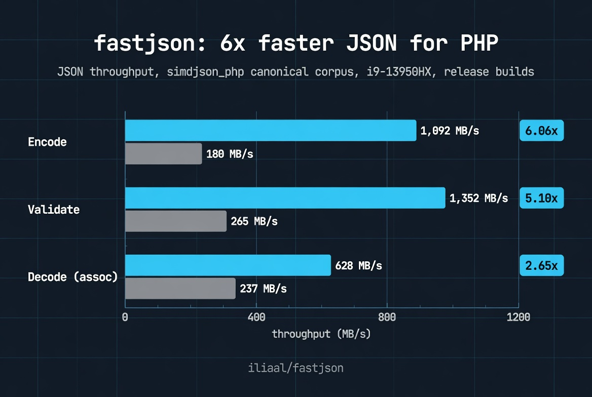

# fastjson

[](https://github.com/iliaal/fastjson/actions/workflows/tests.yml)
[](https://github.com/iliaal/fastjson/actions/workflows/release-windows.yml)
[](https://github.com/iliaal/fastjson/releases)
[](https://opensource.org/licenses/BSD-3-Clause)
[](https://x.com/intent/follow?screen_name=iliaa)



Fast JSON encode, decode, and validate for PHP 8.3+. Drop-in alternative to `ext/json` with a namespaced `fastjson_*` API and `json_last_error`-compatible error reporting. Backed by [yyjson](https://github.com/ibireme/yyjson) 0.12.0, one of the fastest portable JSON libraries. Coexists with `ext/json`; adoption is opt-in per call site.

> **Status:** pre-release. yyjson 0.12.0 is vendored and linked. The full `fastjson_encode` / `fastjson_decode` / `fastjson_validate` trio plus `fastjson_last_error` / `_msg` are available. The compat harness against `php-src/ext/json/tests/*.phpt` passes everything targeting features fastjson aims to mirror; the rest is categorized in `tests/upstream-json/.skiplist`.

## 📦 Install

```bash
# PIE (PHP Foundation's extension installer; uses the composer.json
# at the repo root with type: "php-ext")
pie install iliaal/fastjson
```

On a minimal PHP image (e.g. `php:8.x-cli` from Docker Hub), PIE needs a few build tools installed first:

```bash
# Debian/Ubuntu
sudo apt install -y git bison libtool-bin

# macOS
brew install bison libtool
```

### From source

```bash
git clone https://github.com/iliaal/fastjson.git
cd fastjson
phpize && ./configure --enable-fastjson
make -j
sudo make install
echo 'extension=fastjson.so' | sudo tee /etc/php/conf.d/fastjson.ini
```

### Windows binaries

Pre-built DLLs for PHP 8.3, 8.4, and 8.5 (TS/NTS, x86/x64) are attached to each [GitHub release](https://github.com/iliaal/fastjson/releases).

## 🛠️ Usage

```php
$json = fastjson_encode(['hello' => 'world']);     // string|false
$data = fastjson_decode($json, assoc: true);        // mixed
$ok   = fastjson_validate($json);                   // bool

if ($data === null && fastjson_last_error() !== 0) {
    fwrite(STDERR, fastjson_last_error_msg());
}
```

Function signatures track `ext/json` so call sites migrate by search-and-replace from `json_*` to `fastjson_*`. PHP 8.4 property hooks and `JsonSerializable` are honored.

**Encode flags:** `JSON_PRETTY_PRINT`, `JSON_UNESCAPED_SLASHES`, `JSON_UNESCAPED_UNICODE`, `JSON_FORCE_OBJECT`, `JSON_HEX_TAG`, `JSON_HEX_AMP`, `JSON_HEX_APOS`, `JSON_HEX_QUOT`, `JSON_NUMERIC_CHECK`, `JSON_PRESERVE_ZERO_FRACTION`, `JSON_PARTIAL_OUTPUT_ON_ERROR`, `JSON_INVALID_UTF8_IGNORE`, `JSON_INVALID_UTF8_SUBSTITUTE`, `JSON_THROW_ON_ERROR`.

**Decode flags:** `JSON_OBJECT_AS_ARRAY`, `JSON_BIGINT_AS_STRING`, `JSON_INVALID_UTF8_IGNORE`, `JSON_INVALID_UTF8_SUBSTITUTE`, `JSON_THROW_ON_ERROR`.

**Validate flags:** `JSON_INVALID_UTF8_IGNORE` (other bits raise `ValueError` per ext/json's contract).

See [`CHANGELOG.md`](CHANGELOG.md) for the full feature list and the divergences from `ext/json` that fastjson does not aim to mirror byte-for-byte.

## 📊 Performance

Throughput vs `ext/json` on the full 14.8 MB / 15-file canonical corpus from simdjson_php's [jsonexamples](https://github.com/crazyxman/simdjson_php/tree/master/jsonexamples). i9-13950HX, **release build of both PHP and fastjson** (`-O2`, `Debug Build => no`):

| Operation | fastjson | ext/json | speedup |
|---|--:|--:|--:|
| Decode (stdClass)    | 602 MB/s   | 227 MB/s | **2.66x** |
| Decode (assoc array) | 628 MB/s   | 237 MB/s | **2.65x** |
| Encode               | 1,092 MB/s | 180 MB/s | **6.06x** |
| Validate             | 1,352 MB/s | 265 MB/s | **5.10x** |

A visual side-by-side including `ext/json` + php-src#17734 (SIMD encode) and `simdjson_php` on the same PHP 8.6.0-dev build is published at [**iliaal.github.io/fastjson**](https://iliaal.github.io/fastjson/baseline.html). Methodology, per-file numbers, small-corpus + per-call latency breakdown, and how to reproduce: [`bench/README.md`](bench/README.md) and [`bench/baseline.md`](bench/baseline.md).

### Memory tradeoff

fastjson trades memory for speed on decode (yyjson's two-stage parser holds the doc alongside the zval tree). Decode peak is ~1.7x ext/json's heap. **Encode runs one-stage** (direct-write into smart_str using yyjson primitives) so encode memory is at near-parity with ext/json (~1.1x). Validate peaks at ~101x: lower than ext/json's true streaming validator (constant ~80 bytes) but already 2.7x better than yyjson's stock read path thanks to vendor patch P-002. See [`vendor/yyjson/PATCHES.md`](vendor/yyjson/PATCHES.md). For most callers the speedup is worth the memory headroom; if you're validate-heavy on giant inputs in tight `memory_limit` settings, it's a real consideration.

## ✨ What's in the box

- Bundled yyjson 0.12.0 (MIT) with three local patches submitted upstream as ibireme/yyjson #263, #264, #265, #266. Full notes in [`vendor/yyjson/PATCHES.md`](vendor/yyjson/PATCHES.md).
- yyjson allocator routes every malloc/realloc/free through Zend's `emalloc`/`erealloc`/`efree`. JSON allocations participate in `memory_limit` accounting and request-scoped cleanup.
- `FASTJSON_ERROR_*` constants intentionally match `JSON_ERROR_*` byte-for-byte, so callers can use either set.
- 62-test compat harness rewritten from `php-src/ext/json/tests/*.phpt` runs alongside the native phpt suite. `tests/upstream-json/.skiplist` and `tests/upstream-json/STATE.md` track which upstream tests fastjson does not aim to pass byte-for-byte.
- Depth and stack-overflow guards on encode and decode via `zend_call_stack_overflowed`. Deeply chained inputs fail cleanly instead of being killed by the OS.

## Roadmap

- [ ] `fastjson_validate` success-path depth enforcement (currently argument-validated but the cap is not walked, since yyjson's validate-only mode has no parse-time depth flag and a post-parse walk halves the success-path throughput)
- [ ] Streaming / incremental decode and encode

## 🔗 PHP Performance Toolkit

Companion native PHP extensions for high-throughput PHP workloads:

- **[php_excel](https://github.com/iliaal/php_excel)**: native Excel I/O. 7-10x faster than PhpSpreadsheet, full XLS/XLSX with formulas, formatting, and styling. Powered by LibXL.
- **[mdparser](https://github.com/iliaal/mdparser)**: native CommonMark + GFM parser. 15-30x faster than pure-PHP alternatives, 652/652 spec examples pass.
- **[php_clickhouse](https://github.com/iliaal/php_clickhouse)**: native ClickHouse client speaking the wire protocol directly. Picks up where SeasClick left off.
- **[fastchart](https://github.com/iliaal/fastchart)**: native chart-rendering extension. 26 chart types behind one fluent OO API, SVG-canonical with PNG/JPG/WebP output (no libgd dependency).

## License

- Wrapper code (`fastjson*.c`, `php_fastjson.h`) under BSD 3-Clause.
- Bundled yyjson sources under MIT. Upstream LICENSE preserved verbatim and surfaced in Section 2 of the project [LICENSE](LICENSE) file.

---

[Follow @iliaa on X](https://x.com/iliaa) • [Blog](https://ilia.ws) • If this sped up your stack, ⭐ star it!
