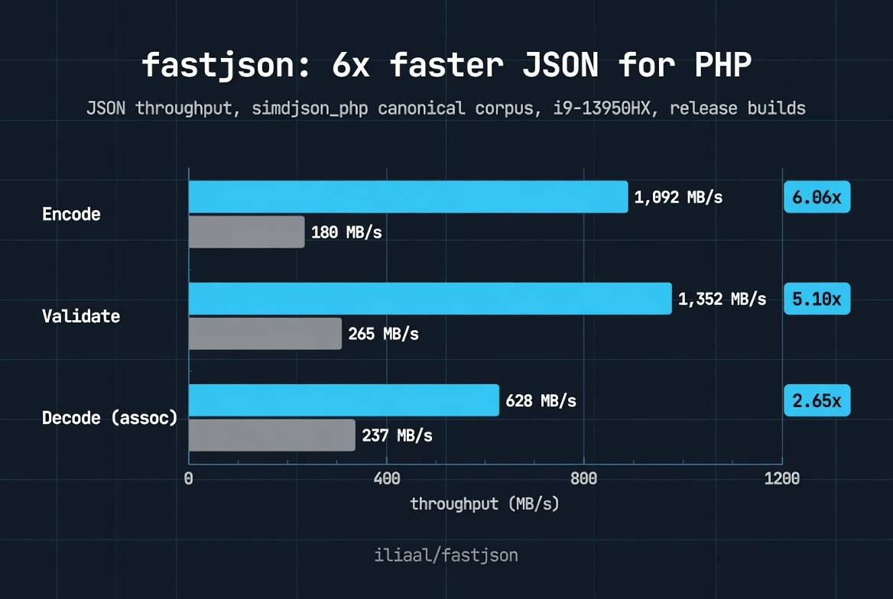

# fastjson

[](https://github.com/iliaal/fastjson/actions/workflows/tests.yml)
[](https://github.com/iliaal/fastjson/actions/workflows/release-windows.yml)
[](https://github.com/iliaal/fastjson/releases)
[](https://opensource.org/licenses/BSD-3-Clause)
[](https://x.com/intent/follow?screen_name=iliaa)



Fast JSON encode, decode, and validate for PHP 8.1+. A drop-in alternative to `ext/json` with a `fastjson_*` API and `json_last_error`-compatible error reporting, built on [yyjson](https://github.com/ibireme/yyjson) 0.13.0. It coexists with `ext/json`, so you adopt it one call site at a time.

> Status: pre-release. Available now: `fastjson_encode` / `fastjson_decode` / `fastjson_validate`, `fastjson_last_error` / `_msg` / `_pos` / `_info`, the file helpers `fastjson_file_decode` / `fastjson_file_encode`, and the JSON Pointer / patch helpers `fastjson_pointer_get` / `_exists` / `_set` (RFC 6901) and `fastjson_merge_patch` (RFC 7396). The compat harness against `php-src/ext/json/tests/*.phpt` passes every test for features fastjson mirrors; `tests/upstream-json/.skiplist` categorizes the rest.

## 📦 Install

```bash
# PIE (PHP Foundation's extension installer; uses the composer.json
# at the repo root with type: "php-ext")
pie install iliaal/fastjson
```

On a minimal PHP image (for example `php:8.x-cli` from Docker Hub), install these build tools before running PIE:

```bash
# Debian/Ubuntu
sudo apt install -y git bison libtool-bin

# macOS
brew install bison libtool
```

### From source

```bash
git clone https://github.com/iliaal/fastjson.git
cd fastjson
phpize && ./configure --enable-fastjson
make -j
sudo make install
echo 'extension=fastjson.so' | sudo tee /etc/php/conf.d/fastjson.ini
```

### Windows binaries

Pre-built 64-bit DLLs for PHP 8.1 through 8.5 (TS/NTS) are attached to each [GitHub release](https://github.com/iliaal/fastjson/releases).

## 🛠️ Usage

```php
$json = fastjson_encode(['hello' => 'world']);     // string|false
$data = fastjson_decode($json, associative: true);  // mixed
$ok   = fastjson_validate($json);                   // bool

if ($data === null && fastjson_last_error() !== 0) {
    fwrite(STDERR, fastjson_last_error_msg());
}
```

Function signatures match `ext/json`, so you can migrate a call site by replacing `json_*` with `fastjson_*`. PHP 8.4 property hooks and `JsonSerializable` work as they do in `ext/json`.

**Encode flags:** `JSON_PRETTY_PRINT`, `JSON_UNESCAPED_SLASHES`, `JSON_UNESCAPED_UNICODE`, `JSON_FORCE_OBJECT`, `JSON_HEX_TAG`, `JSON_HEX_AMP`, `JSON_HEX_APOS`, `JSON_HEX_QUOT`, `JSON_NUMERIC_CHECK`, `JSON_PRESERVE_ZERO_FRACTION`, `JSON_PARTIAL_OUTPUT_ON_ERROR`, `JSON_INVALID_UTF8_IGNORE`, `JSON_INVALID_UTF8_SUBSTITUTE`, `JSON_THROW_ON_ERROR`.

**Decode flags:** `JSON_OBJECT_AS_ARRAY`, `JSON_BIGINT_AS_STRING`, `JSON_INVALID_UTF8_IGNORE`, `JSON_INVALID_UTF8_SUBSTITUTE`, `JSON_THROW_ON_ERROR`, and the fastjson-only `FASTJSON_DECODE_RELAXED` (tolerates the JSONC subset `ext/json` rejects: `//` and `/* */` comments, trailing commas, and a leading UTF-8 BOM).

**Validate flags:** `JSON_INVALID_UTF8_IGNORE` (other bits raise `ValueError` per ext/json's contract). `$depth` is enforced on the success path like `ext/json`: documents nesting `$depth` or more containers deep validate false with a depth error.

**File helpers:** `fastjson_file_decode()` / `fastjson_file_encode()` read and write a JSON file in one call through the PHP streams layer (`open_basedir` and stream wrappers apply). `fastjson_file_encode()` opens the destination in write mode and does not replace it atomically; if a partial write would be unsafe, write to a temp file and rename it yourself. File I/O failures reuse `FASTJSON_ERROR_SYNTAX` to stay inside the `JSON_ERROR_*` code range. To tell a filesystem fault from a parse or encode failure, check `fastjson_last_error_msg()` for the `Failed to ... file` messages.

**JSON Pointer and merge patch:** `fastjson_pointer_get()` extracts one value by [RFC 6901](https://www.rfc-editor.org/rfc/rfc6901) JSON Pointer without materializing the rest of the document. `fastjson_pointer_exists()` reports whether a pointer resolves, so you can tell "present but null" from "absent". `fastjson_pointer_set()` sets one value by pointer and returns the re-serialized document; it splices the edit into the parsed document, so a single edit on a large document skips a full decode and re-encode. Formatting and escaping flags apply to the whole pointer-set output; value-transforming flags apply only to the replacement. Pointer-set rejects a target member that appears more than once in its object. `fastjson_merge_patch()` applies an [RFC 7396](https://www.rfc-editor.org/rfc/rfc7396) merge patch and collapses duplicate members in each merged object to the last value at the first insertion position. Merge-patch member matching uses the raw JSON key bytes. `JSON_INVALID_UTF8_IGNORE` and `JSON_INVALID_UTF8_SUBSTITUTE` sanitize only the materialized PHP result, so malformed and valid key spellings that sanitize to the same PHP key stay distinct during the merge.

**Error location:** `fastjson_last_error_pos()` returns the byte offset of the most recent parse error (`-1` when none). `fastjson_last_error_info()` returns `['code', 'msg', 'pos', 'line', 'col']` (1-based line and column) in one call, so you can point at where malformed JSON broke. Under `JSON_THROW_ON_ERROR` the thrown class is `JsonException` when `ext/json` is loaded, `Fastjson\JsonException` otherwise.

[`CHANGELOG.md`](CHANGELOG.md) has the full feature list and the known divergences from `ext/json` output.

## 📊 Performance

Throughput vs `ext/json` on the full 14.8 MB / 15-file canonical corpus from simdjson_php's [jsonexamples](https://github.com/crazyxman/simdjson_php/tree/master/jsonexamples). i9-13950HX, **release build of both PHP and fastjson** (`-O2`, `Debug Build => no`):

| Operation | fastjson | ext/json | speedup |
|---|--:|--:|--:|
| Decode (stdClass)    | 428 MB/s | 165 MB/s | **2.59x** |
| Decode (assoc array) | 410 MB/s | 172 MB/s | **2.39x** |
| Encode               | 748 MB/s | 135 MB/s | **5.56x** |
| Validate             | 994 MB/s | 197 MB/s | **5.04x** |

A visual comparison against `ext/json` on PHP 8.4 is at [iliaal.github.io/fastjson](https://iliaal.github.io/fastjson/baseline.html). [`bench/README.md`](bench/README.md) and [`bench/baseline.md`](bench/baseline.md) cover methodology, per-file numbers, small-corpus and per-call latency, and how to reproduce.

### Memory tradeoff

Decode trades memory for speed: yyjson's two-stage parser holds the parsed document alongside the zval tree, so decode peaks at 1.2x to 3.1x ext/json's heap (1.65x across the bench corpus; number-heavy documents sit at the top). Repeated short object keys share one string per walk, which took `twitter.json` from 1.66x to 1.39x. Encode writes directly into a smart_str with yyjson primitives, so its peak is within 9% of ext/json on the bench corpus. A single escaped string of 8 KiB to a few tens of KiB can peak up to twice ext/json's size, because the chunked writer keeps up to 12 KiB of headroom. Validate reads the caller's buffer and keeps no value tree, so its peak is a few dozen bytes, like ext/json's streaming validator.

## ✨ What's in the box

- Bundled yyjson 0.13.0 (MIT) with local patches P-002 through P-009. Notes and the replayable series are in [`vendor/yyjson/PATCHES.md`](vendor/yyjson/PATCHES.md) and [`vendor/yyjson/patches/`](vendor/yyjson/patches/).
- yyjson allocates through Zend's `emalloc`/`erealloc`/`efree`, so JSON allocations count against `memory_limit` and are freed at request end.
- `FASTJSON_ERROR_*` constants match the `JSON_ERROR_*` numeric values, so you can use either set. yyjson reports raw control-character and invalid-surrogate parse failures under the UTF-8 code; the aliases exist even where fastjson does not emit the more specific ext/json code.
- 67-test compat harness rewritten from `php-src/ext/json/tests/*.phpt` runs alongside the native phpt suite. `tests/upstream-json/.skiplist` and `tests/upstream-json/STATE.md` list the upstream tests fastjson does not try to match byte-for-byte.
- Depth and stack-overflow guards use `zend_call_stack_overflowed` where Zend exposes it and conservative recursion caps elsewhere, so deeply nested input fails with an error instead of crashing the process.

## Roadmap

- [x] `fastjson_validate` success-path depth enforcement (allocation-free nesting scan; the validate-only fast path is kept)
- [ ] Streaming / incremental decode and encode

## 🔗 Native PHP extensions

- **[php_excel](https://github.com/iliaal/php_excel)**: native Excel I/O via LibXL. 7-10× faster than PhpSpreadsheet, full XLS/XLSX with formulas, formatting, and styling.
- **[mdparser](https://github.com/iliaal/mdparser)**: native CommonMark + GFM markdown parser via md4c. 15-30× faster than pure-PHP libraries.
- **[php_clickhouse](https://github.com/iliaal/php_clickhouse)**: native ClickHouse client speaking the wire protocol directly. Picks up where SeasClick left off.
- **[pdo_duckdb](https://github.com/iliaal/pdo_duckdb)**: PDO driver for DuckDB, analytical SQL in your PHP stack.
- **[phpser](https://github.com/iliaal/phpser)**: decoder-optimized binary serializer for cache workloads. Faster than igbinary on packed numerics and DTO batches.
- **[fast_uuid](https://github.com/iliaal/fast_uuid)**: high-throughput UUID generation (v1/v4/v7), batched CSPRNG and SIMD hex formatter, ramsey-compatible API.
- **[fastchart](https://github.com/iliaal/fastchart)**: native chart-rendering extension. 38 chart types behind one fluent OO API, SVG-canonical with PNG/JPG/WebP and optional PDF output.
- **[statgrab](https://github.com/iliaal/statgrab)**: system statistics (CPU, memory, disk, network) via libstatgrab, no parsing /proc by hand.
- **[phonetic](https://github.com/iliaal/phonetic)**: native phonetic name matching (Double Metaphone, Beider-Morse, Daitch-Mokotoff, NYSIIS, Match Rating), the encoders PHP core lacks.

## License

- Wrapper code (`fastjson*.c`, `php_fastjson.h`) under BSD 3-Clause.
- Bundled yyjson sources under MIT. Upstream LICENSE preserved verbatim and surfaced in Section 2 of the project [LICENSE](LICENSE) file.

---

[Follow @iliaa on X](https://x.com/iliaa) • [Blog](https://ilia.ws) • If this sped up your stack, ⭐ star it!
